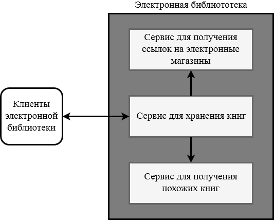

### Микросервисная архитектура
В предыдущем разделе был реализован сервис, который может удалять, добавлять и фильтровать список книг. По условию технического задания нам осталось добавить некоторые подфункции. Эти функции довольно сложны и поэтому разрабатываются смежными командами в виде отдельных сервисов. Мы же будем выступать для этих сервисов в качестве потребителей.

Микросервисная архитектура - это модульный подход, при котором приложение функционально разделяется на отдельные сервисы. В результате разработчики больших и сложных приложений могут быстрее выпускать качественный продукт. Если коротко, то архитектурный стиль микросервисов — это подход, при котором единое приложение строится как набор небольших сервисов, каждый из которых работает в собственном процессе и коммуницирует с остальными используя легковесные механизмы, как правило HTTP.



Разрабатываемая электронная библиотека будет состоять из трех сервисов: каталога книг, сервис для получения похожих книг и сервиса для получения ссылки с самыми дешевыми ценами. Внешние клиенты будут общаться с сервисом каталога книг, который в свою очередь будет получать информацию из других источников. 

*Примечание: Стоит задуматься, чтобы внешние клиенты обращались к отдельному сервису-агрегатору информации. Этот агрегшатор собирал бы информацию со всех трех сервисов.*

С кодом смежных сервисов вы можете ознакомиться отдельно. [Сервис похожих книг](/04_microservices/related_service.go) и [сервис электронной коммерции](/04_microservices/shops_service.js). Не будем подробно останавливаться над исходным кодом сервисов. Они предстваляют из себя такие же HTTP сервера, как и наш основной сервис. Заметим, что один из смежных сервисов реализован на других технологиях нежели наш основной сервис. Это одно из преимуществ микросервисной архитектуры. Однако, не стоит этим преимуществом злоупотреблять.

Остановимся над взаимодействием основного сервиса со смеждными.
```js
// получение данных средствами HTTP запроса

```

## Полезные ссылки
### Поверхностное чтение
* https://habr.com/company/nixsolutions/blog/321686/
* https://habr.com/post/249183/

### Углубленное чтение
* https://www.ibm.com/developerworks/ru/library/1601_clark-trs/
* http://microservices.io/patterns/microservices.html

* https://blog.netsil.com/http-2-and-grpc-the-next-generation-of-microservices-interactions-aff4ffa6faed
* https://blog.bugsnag.com/grpc-and-microservices-architecture/
