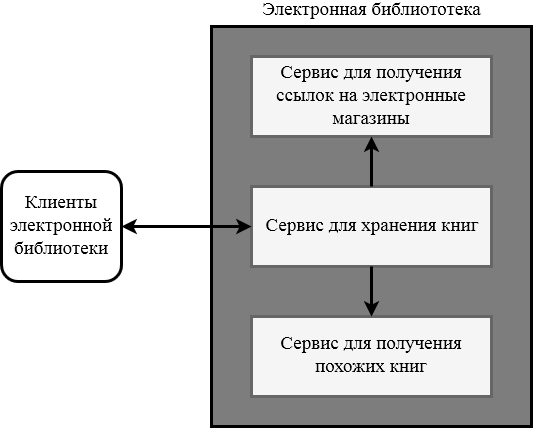

# sem-02
Микросервисы

## Цель


## План
* HTTP
* Сериализация, json, xml
* API
* HTTPS
* принципы микросервисов
* HTTP/2
* proto
* gRPC


### Протокол HTTP
HTTP — широко распространённый протокол передачи данных, изначально предназначенный для передачи гипертекстовых документов (то есть документов, которые могут содержать ссылки, позволяющие организовать переход к другим документам).

Протокол HTTP предполагает использование клиент-серверной структуры передачи данных. Клиентское приложение формирует запрос и отправляет его на сервер, после чего серверное программное обеспечение обрабатывает данный запрос, формирует ответ и передаёт его обратно клиенту.

Задача, которая традиционно решается с помощью протокола HTTP — обмен данными между пользовательским приложением и веб-сервером.

Как правило, передача данных по протоколу HTTP осуществляется через TCP/IP-соединения. Серверное программное обеспечение при этом обычно использует TCP-порт 80, хотя может использовать и любой другой.

Каждое HTTP-сообщение состоит из трёх частей, которые передаются в указанном порядке:
* стартовая строка (англ. Starting line) — определяет тип сообщения;
* заголовки (англ. Headers) — характеризуют тело сообщения, параметры передачи и прочие сведения;
* тело сообщения (англ. Message Body) — непосредственно данные сообщения. Обязательно должно отделяться от заголовков пустой строкой.

Тело сообщения может отсутствовать.

Стартовые строки различаются для запроса и ответа.

Строка запроса выглядит так:

```
Method URI HTTP/Version
```

Здесь:
* Метод (англ. Method) — тип запроса, одно слово заглавными буквами;
* URI определяет путь к запрашиваемому документу;
* Версия (англ. Version) — пара разделённых точкой цифр.
```
GET /wiki/HTTP HTTP/1.0
Host: ru.wikipedia.org
```

Стартовая строка ответа сервера имеет следующий формат:

```
HTTP/Version StatusCode ReasonPhrase
```

Здесь:
* Версия (англ. Version) — пара разделённых точкой цифр, как в запросе;
* Код состояния (англ. Status Code). По коду состояния определяется дальнейшее содержимое сообщения и поведение клиента;
* Пояснение (англ. Reason Phrase) — текстовое короткое пояснение к коду ответа для пользователя. Никак не влияет на сообщение и является необязательным.
```
HTTP/1.0 200 OK
```

#### Методы

Метод HTTP (англ. HTTP Method) — последовательность из любых символов, кроме управляющих и разделителей, указывающая на основную операцию над ресурсом. Сервер может использовать любые методы, не существует обязательных методов для сервера или клиента. Если сервер не распознал указанный клиентом метод, то он должен вернуть статус 501 (Not Implemented). Если серверу метод известен, но он неприменим к конкретному ресурсу, то возвращается сообщение с кодом 405 (Method Not Allowed). В обоих случаях серверу следует включить в сообщение ответа заголовок Allow со списком поддерживаемых методов.

Рассмотрим популярные методы.

##### GET
Используется для запроса содержимого указанного ресурса. Клиент может передавать параметры выполнения запроса в URI целевого ресурса после символа «?»:
```
GET /path/resource?param1=value1&param2=value2 HTTP/1.1
```
Согласно стандарту HTTP, запросы типа GET считаются идемпотентными.

##### HEAD
Аналогичен методу GET, за исключением того, что в ответе сервера отсутствует тело. Запрос HEAD обычно применяется для извлечения метаданных, проверки наличия ресурса (валидация URL) и чтобы узнать, не изменился ли он с момента последнего обращения.

##### POST
Применяется для передачи пользовательских данных заданному ресурсу. Например, в блогах посетители обычно могут вводить свои комментарии к записям в HTML-форму, после чего они передаются серверу методом POST и он помещает их на страницу. При этом передаваемые данные включаются в тело запроса. Аналогично с помощью метода POST обычно загружаются файлы на сервер. В отличие от метода GET, метод POST не считается идемпотентным, то есть многократное повторение одних и тех же запросов POST может возвращать разные результаты.

##### PUT
Применяется для загрузки содержимого запроса на указанный в запросе URI. Фундаментальное различие методов POST и PUT заключается в понимании предназначений URI ресурсов. Метод POST предполагает, что по указанному URI будет производиться обработка передаваемого клиентом содержимого. Используя PUT, клиент предполагает, что загружаемое содержимое соответствует находящемуся по данному URI ресурсу.

##### DELETE
Удаляет указанный ресурс.

#### Status Code
Код состояния является частью первой строки ответа сервера. Первая цифра указывает на класс состояния.
* 2xx -	Success
* 3xx - Redirection
* 4xx - Client Error
* 5xx - Server Error

Примеры:
* 200 OK;
* 201 Created;
* 302 Moved Temporarily;
* 302 Found;
* 400 Bad Request;
* 403 Forbidden;
* 404 Not Found;
* 500 Internal Server Error.

### Простой HTTP сервер
Реализуем простой HTTP сервер, который обрабатывает GET запросы.
```js
const express = require('express');
const app = express();
app.get('/', (req, res) => {
    res.end("Hello, world!");
});
app.listen(8000);
```
Запустим приложение и перейдем в браузере по адресу `http://localhost:8000/`. В окне браузера появится надпись `Hello, world!`.

В [примере](/01_http/server.js) представлен пример немного посложнее.

### Сериализация
HTTP протокол можно использовать для передачи произвольных данные по сети. Но прежде, чем использовать его, требуется "договориться" о формате передачи данных между клиентом и сервером - необходим формат представления целевых объектов.
Сериализация (англ. serialization) — процесс перевода какой-либо структуры данных в последовательность битов. Сериализация используется для передачи объектов по сети и для сохранения их в файлы. Например, нужно создать распределённое приложение, разные части которого должны обмениваться данными со сложной структурой. В таком случае для типов данных, которые предполагается передавать, пишется код, который осуществляет сериализацию и десериализацию. Объект заполняется нужными данными, затем вызывается код сериализации, в результате получается, например, XML-документ. Результат сериализации передаётся принимающей стороне по, скажем, электронной почте или HTTP. Приложение-получатель создаёт объект того же типа и вызывает код десериализации, в результате получая объект с теми же данными, что были в объекте приложения-отправителя.

Рассмотрим популярный формат **JSON**.

Предположим, у нас есть объект типа `Book`. Этот объект имеет следующие поля:
* строковый параметр "название книги" `Name`;
* массив строк "имена авторов" - `Authors`;
* целочисленный параметр "год издания" - `Year`;
* числовой параметр "цена" - `Price`;
* подобъект "контакты издателя" - `Publisher`.

Тогда JSON представление этого объекта будет выглядеть так:
```js
{
  "Name": "Design Patterns",
  "Years": 2016,
  "Price": 15.4,
  "Authors": [
    "Erich  Gamma",
    "Ralph  Johnson",
    "Richard  Helm",
    "John  Vlissides"
  ],
  "Publisher": {
    "Name": "Addison-Wesley",
    "Website": "https://www.pearsonschool.com/"
  }
}
```

```js
// serializing an object
const text = JSON.stringify(obj, null, 2);

// deserializing
const obj = JSON.parse(text);
```

В [примере](/02_serialization/server.js) показана сериализация объектов и передача их по HTTP протоколу.

### API
API (англ. application programming interface) — набор готовых классов, процедур, функций, структур и констант, предоставляемых приложением (или библиотекой, сервисом, операционной системой) для использования во внешних программных продуктах. 

API многих программных продуктов также подразумевает использование HTTP для передачи данных — сами данные при этом могут иметь любой формат, например, XML или JSON. HTTP часто используется как протокол передачи информации для других протоколов прикладного уровня, таких как SOAP, XML-RPC и WebDAV. В таком случае говорят, что протокол HTTP используется как «транспорт».

Попробуем разработать API, который предоставляет доступ к библиотеки. API будет иметь несколько функций:
* фильтрация имеющихся книг по автору;
* добавление книги;
* удаление книги;
* получать ссылку на книгу в электронном магазине;
* предоставление похожих книг.

Для первой и последней функции будем использовать GET запросы протокола HTTP. Для добавления книги - метод POST, для удаления - DELETE. Для представления объектов будем использовать формат JSON.

Полный код сервиса смотрите [по ссылке](/03_api).

Первая версия нашего сервиса будет иметь урезанный функционал. А точнее она будет возвращать весь список книг.
```js
function booksApiHandler(req, res) {
    const books = getBooksFromDB();
    const text = JSON.stringify(books, null, 2);
    res.end(text);
}

app.get('/api/v1/books', booksApiHandler);
```
Необходимо заметить, что часто прибегают к версионированию предоставляемого API. Так наш сервис имеет версию 1, поэтому все обработчики хранятся в каталоге `/api/v1/`. На этом разработка первой версии закончена и была отложена на долгое время. После появилась необходимость переделать существующее API. Но за это время наш сервис приобрел "популярность" и им пользуются многие клиенты. Чтобы не изменять поведение клиентов, мы будем разрабатывать версию API номер 2.

```js
function booksNewApiHandler(req, res) {

    let books = getBooksFromDB();

    const {author} = req.query;
    if (author) {

        let filteredBooks = [];
        books.forEach((book) => {
            if (book.Author === author)
                filteredBooks.push(book)
        });

        books = filteredBooks;

    }
    res.end(JSON.stringify(books, null, 2));
}
app.get('/api/v2/books', booksNewApiHandler);
```
Теперь мы можем получить или весь список имеющихся книг, или книги интересующего автора. Для этого клиентам API надо в запросе передать параметр `author`. Пример запроса: `http://localhost/api/v2/books?author=Scott Meyers`.


### Микросервисная архитектура
В предыдущем разделе был реализован сервис, который может удалять, добавлять и фильтровать список книг. По условию технического задания нам осталось добавить некоторые подфункции. Эти функции довольно сложны и поэтому разрабатываются смежными командами в виде отдельных сервисов. Мы же будем выступать для этих сервисов в качестве потребителей.

Микросервисная архитектура - это модульный подход, при котором приложение функционально разделяется на отдельные сервисы. В результате разработчики больших и сложных приложений могут быстрее выпускать качественный продукт. Микросервисная архитектура улучшает масштабируемость приложений за счет возможности развёртывать каждый отдельный сервис на оптимальном для него оборудовании. Если коротко, то архитектурный стиль микросервисов — это подход, при котором единое приложение строится как набор небольших сервисов, каждый из которых работает в собственном процессе и коммуницирует с остальными используя легковесные механизмы, как правило HTTP.



Разрабатываемая электронная библиотека будет состоять из трех сервисов: каталога книг, сервис для получения похожих книг и сервиса для получения ссылки с самыми дешевыми ценами. Внешние клиенты будут общаться с сервисом каталога книг, который в свою очередь будет получать информацию из других источников. 

*Примечание: Стоит задуматься, чтобы внешние клиенты обращались к отдельному сервису-агрегатору информации. Этот агрегшатор собирал бы информацию со всех трех сервисов.*

С кодом смежных сервисов вы можете ознакомиться отдельно. [Сервис похожих книг](/04_microservices/related_service.go) и [сервис электронной коммерции](/04_microservices/shops_service.js). Не будем подробно останавливаться над исходным кодом сервисов. Они предстваляют из себя такие же HTTP сервера, как и наш основной сервис. Заметим, что один из смежных сервисов реализован на других технологиях нежели наш основной сервис. Это одно из преимуществ микросервисной архитектуры. Однако, не стоит этим преимуществом злоупотреблять.

Остановимся над взаимодействием основного сервиса со смеждными.
```js
// получение данных средствами HTTP запроса

```


## Полезные ссылки
### Поверхностное чтение
* https://habr.com/post/215117/
* https://ru.wikipedia.org/wiki/HTTP
* https://en.wikipedia.org/wiki/Serialization
* https://ru.wikipedia.org/wiki/JSON
* https://ru.wikipedia.org/wiki/API
* https://habr.com/company/nixsolutions/blog/321686/
* https://habr.com/post/249183/

### Углубленное чтение
* http://microservices.io/patterns/microservices.html

* https://grpc.io/blog/vendastagrpc
* https://blog.netsil.com/http-2-and-grpc-the-next-generation-of-microservices-interactions-aff4ffa6faed
* https://hpbn.co/http2/#brief-introduction-to-binary-framing
* https://blog.bugsnag.com/grpc-and-microservices-architecture/

